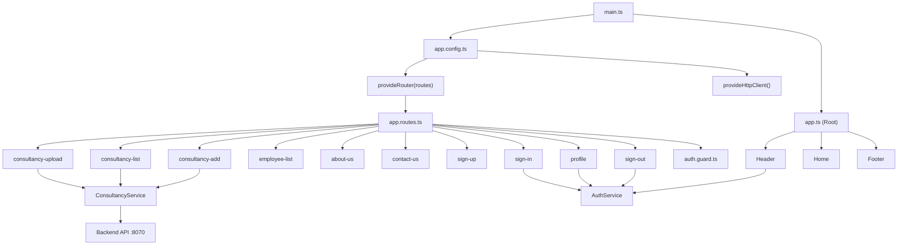
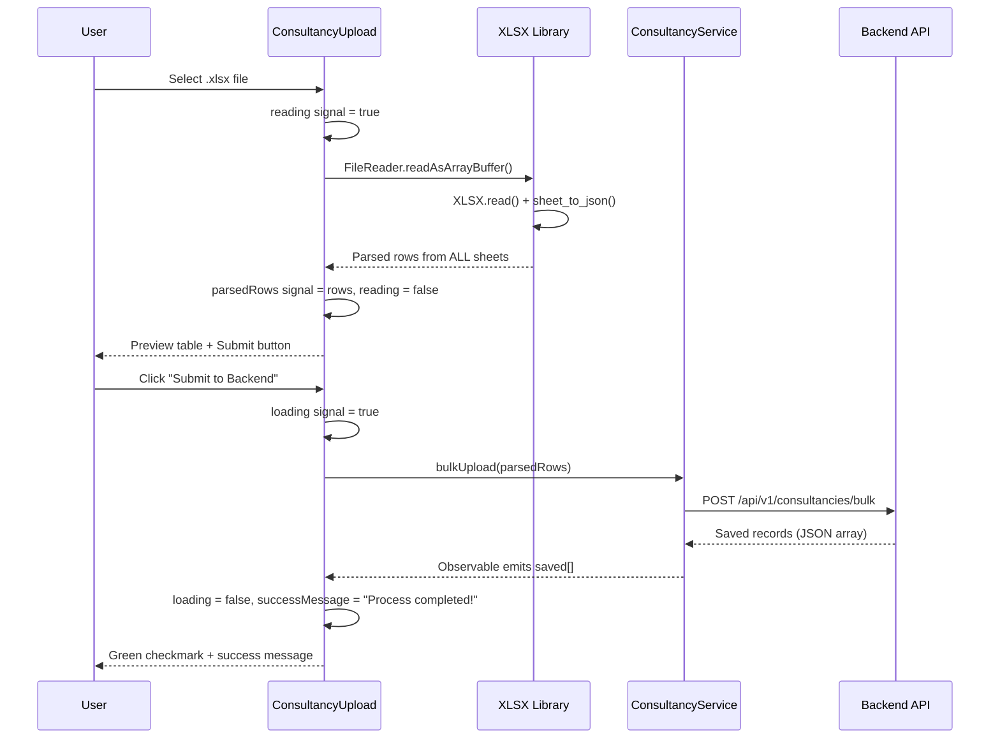
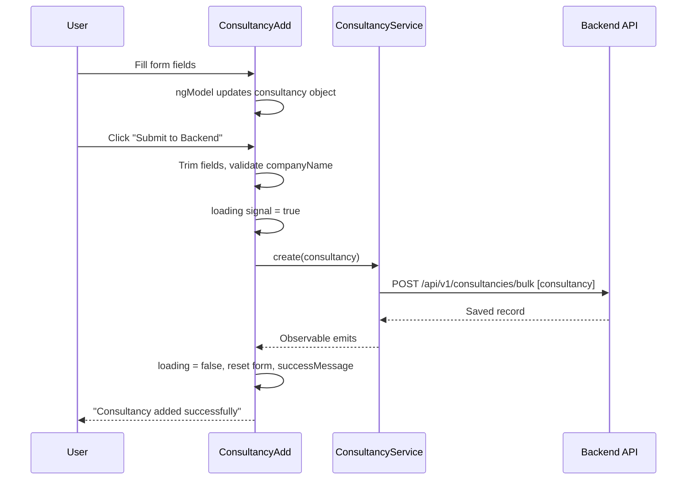
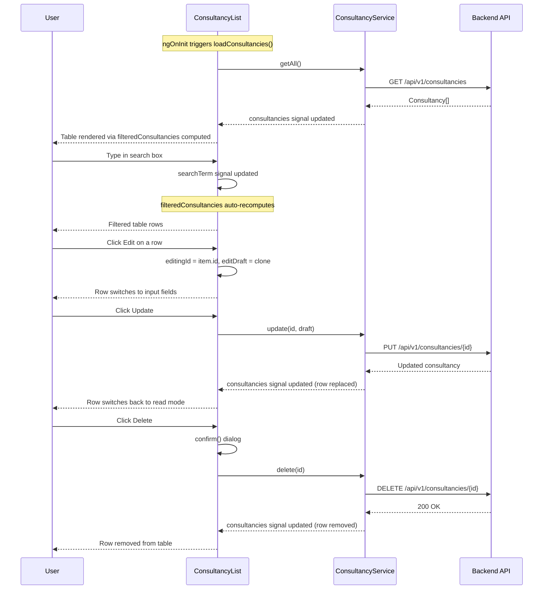
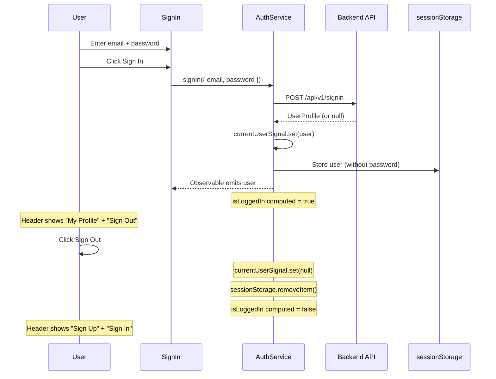

# Raj Technologies — Complete Project Documentation

## Table of Contents

1. [Project Overview](#1-project-overview)
2. [Architecture Diagram](#2-architecture-diagram)
3. [Configuration Files](#3-configuration-files)
4. [Bootstrap Chain](#4-bootstrap-chain)
5. [Models](#5-models)
6. [Services](#6-services)
7. [Guards](#7-guards)
8. [Components](#8-components)
9. [Key Angular 21 Concepts Used](#9-key-angular-21-concepts-used)
10. [Data Flow Diagrams](#10-data-flow-diagrams)

---

## 1. Project Overview

**Raj Technologies** is an Angular 21 single-page application for managing IT consultancy company records. It allows users to:

- Upload consultancy data from Excel files (`.xlsx`)
- Add individual consultancy records via a form
- View, search, sort, edit, and delete consultancy records
- Sign up, sign in, view profile, and sign out (authentication)
- View employee listings

### Technology Stack

| Layer | Technology |
|-------|-----------|
| Frontend Framework | Angular 21 (standalone, zoneless, signal-based) |
| Language | TypeScript 5.9 |
| Styling | Scoped CSS per component, CSS custom properties |
| Excel Parsing | `xlsx` library (SheetJS) |
| HTTP | Angular `HttpClient` via `provideHttpClient()` |
| Backend | Spring Boot REST API on `http://localhost:8070` |
| Package Manager | npm 10.9 |
| Build Tool | Angular CLI (`@angular/build`) |
| Testing | Vitest 4.x |

### Project File Structure

```
raj-technologies/
├── angular.json              # Angular CLI workspace configuration
├── package.json              # Dependencies and npm scripts
├── tsconfig.json             # Root TypeScript configuration
├── tsconfig.app.json         # App-specific TypeScript configuration
├── public/
│   └── Belgium_IT_Consultancy_Companies.xlsx  # Sample Excel data
├── src/
│   ├── main.ts               # Application entry point
│   ├── styles.css            # Global styles and CSS variables
│   └── app/
│       ├── app.ts            # Root component
│       ├── app.html          # Root template
│       ├── app.css           # Root styles
│       ├── app.config.ts     # Application-level providers
│       ├── app.routes.ts     # Route definitions
│       ├── models/
│       │   ├── consultancy.model.ts   # Consultancy interface & types
│       │   ├── employee-model.ts      # Employee class
│       │   └── user.model.ts          # UserProfile & SignInRequest interfaces
│       ├── services/
│       │   ├── consultancy.service.ts # Consultancy CRUD + bulk upload
│       │   └── auth.service.ts        # Authentication with signals
│       ├── guards/
│       │   └── auth.guard.ts          # authGuard & guestGuard
│       ├── header/                    # Sticky header with dropdown nav
│       ├── footer/                    # Page footer
│       ├── home/                      # Landing page
│       ├── consultancy-upload/        # Excel upload + bulk submit
│       ├── consultancy-add/           # Manual consultancy entry form
│       ├── consultancy-list/          # List with search/sort/edit/delete
│       ├── employee-list/             # Employee listing
│       ├── about-us/                  # About page
│       ├── contact-us/                # Contact page
│       ├── sign-up/                   # Registration form
│       ├── sign-in/                   # Login form
│       ├── profile/                   # User profile (auth-protected)
│       └── sign-out/                  # Sign-out handler
```

---

## 2. Architecture Diagram



---

## 3. Configuration Files

### 3.1 `angular.json`

This is the Angular CLI workspace configuration file.

```json
{
  "$schema": "./node_modules/@angular/cli/lib/config/schema.json",
  "version": 1,
```

- **`$schema`** — Points to the Angular CLI JSON schema for IDE autocompletion.
- **`version: 1`** — Angular CLI workspace schema version.

```json
  "cli": {
    "packageManager": "npm",
    "analytics": "435db9b8-..."
  },
```

- **`packageManager: "npm"`** — Tells Angular CLI to use npm (not yarn/pnpm).
- **`analytics`** — UUID for Angular CLI usage analytics.

```json
  "projects": {
    "raj-technologies": {
      "projectType": "application",
      "root": "",
      "sourceRoot": "src",
      "prefix": "app",
```

- **`projectType: "application"`** — This is a runnable app (not a library).
- **`root: ""`** — Project root is the workspace root.
- **`sourceRoot: "src"`** — Source files live under `src/`.
- **`prefix: "app"`** — Default component selector prefix (e.g. `app-header`).

```json
      "architect": {
        "build": {
          "builder": "@angular/build:application",
          "options": {
            "browser": "src/main.ts",
            "tsConfig": "tsconfig.app.json",
            "assets": [{ "glob": "**/*", "input": "public" }],
            "styles": ["src/styles.css"]
          },
```

- **`builder: "@angular/build:application"`** — Uses the new Angular esbuild-based builder (Angular 17+).
- **`browser: "src/main.ts"`** — The entry point file.
- **`assets`** — Copies everything from `public/` folder to the build output (e.g. the sample `.xlsx` file).
- **`styles`** — Global stylesheet applied to the entire app.

**Important:** There is NO `polyfills` property. In Angular 21, this means **zone.js is NOT loaded**, making the app **zoneless**. Angular relies on signals for change detection instead.

```json
          "configurations": {
            "production": {
              "budgets": [
                { "type": "initial", "maximumWarning": "500kB", "maximumError": "1MB" },
                { "type": "anyComponentStyle", "maximumWarning": "4kB", "maximumError": "8kB" }
              ],
              "outputHashing": "all"
            },
            "development": {
              "optimization": false,
              "extractLicenses": false,
              "sourceMap": true
            }
          },
          "defaultConfiguration": "production"
        },
```

- **Production config** — Enforces bundle size budgets and adds content hashes to filenames for cache busting.
- **Development config** — Disables optimization, enables source maps for debugging.

### 3.2 `package.json`

```json
{
  "name": "raj-technologies",
  "version": "0.0.0",
  "scripts": {
    "ng": "ng",
    "start": "ng serve",
    "build": "ng build",
    "watch": "ng build --watch --configuration development",
    "test": "ng test"
  },
```

| Script | What it does |
|--------|-------------|
| `npm start` | Starts development server (`ng serve`) |
| `npm run build` | Production build to `dist/` folder |
| `npm run watch` | Rebuilds automatically on file changes |
| `npm test` | Runs unit tests |

```json
  "dependencies": {
    "@angular/common": "^21.2.0",      // HttpClient, pipes, directives
    "@angular/compiler": "^21.2.0",    // Template compiler
    "@angular/core": "^21.2.0",        // Core framework (signals, DI, components)
    "@angular/forms": "^21.2.0",       // FormsModule for ngModel
    "@angular/platform-browser": "^21.2.0", // Browser platform
    "@angular/router": "^21.2.0",      // Client-side routing
    "rxjs": "~7.8.0",                  // Reactive Extensions (Observables)
    "tslib": "^2.3.0",                 // TypeScript runtime helpers
    "xlsx": "^0.18.5"                  // SheetJS for reading Excel files
  },
```

- **Angular 21** — Latest Angular with full signal support and zoneless mode.
- **rxjs** — Used by HttpClient for HTTP requests (returns Observables).
- **xlsx** — Parses `.xlsx` files client-side in the browser.

```json
  "devDependencies": {
    "@angular/build": "^21.2.18",      // esbuild-based builder
    "@angular/cli": "^21.2.18",        // CLI tooling
    "@angular/compiler-cli": "^21.2.0", // AOT compiler
    "typescript": "~5.9.2",            // TypeScript compiler
    "vitest": "^4.0.8"                 // Test runner
  }
```

### 3.3 `tsconfig.json`

```json
{
  "compilerOptions": {
    "strict": true,                         // Enable all strict type checks
    "noImplicitOverride": true,             // Require 'override' keyword
    "noPropertyAccessFromIndexSignature": true, // Enforce bracket notation for index types
    "noImplicitReturns": true,              // All code paths must return a value
    "noFallthroughCasesInSwitch": true,     // Prevent switch case fallthrough
    "skipLibCheck": true,                   // Skip type checking of .d.ts files (faster builds)
    "isolatedModules": true,                // Ensure each file can be transpiled independently
    "experimentalDecorators": true,         // Enable @Component, @Injectable, etc.
    "importHelpers": true,                  // Use tslib for helper functions
    "target": "ES2022",                     // Compile to ES2022 (modern browsers)
    "module": "preserve"                    // Keep import/export syntax as-is for bundler
  },
  "angularCompilerOptions": {
    "enableI18nLegacyMessageIdFormat": false, // Use new i18n message IDs
    "strictInjectionParameters": true,        // Strict DI parameter checking
    "strictInputAccessModifiers": true,       // Enforce access modifiers on @Input
    "strictTemplates": true                   // Full type checking in templates
  }
}
```

### 3.4 `tsconfig.app.json`

```json
{
  "extends": "./tsconfig.json",    // Inherits all settings from root tsconfig
  "compilerOptions": {
    "outDir": "./out-tsc/app",     // Output directory for compiled JS
    "types": []                    // No additional @types packages
  },
  "include": ["src/**/*.ts"],      // Compile all .ts files under src/
  "exclude": ["src/**/*.spec.ts"]  // Exclude test files from app build
}
```

### 3.5 `src/styles.css` — Global Styles

```css
:root {
  --rt-navy: #0b1f3a;       /* Dark navy for headings */
  --rt-blue: #0052cc;       /* Primary brand blue */
  --rt-blue-dark: #003d99;  /* Darker blue for gradients */
  --rt-sky: #e8f0fe;        /* Light blue background */
  --rt-slate: #64748b;      /* Muted text color */
  --rt-ink: #1e293b;        /* Default text color */
  --rt-border: #dbe3f0;     /* Border color */
  --rt-surface: #ffffff;    /* Card/surface background */
  --rt-font: "Manrope", "Segoe UI", sans-serif;      /* Body font */
  --rt-display: "Source Serif 4", Georgia, serif;     /* Heading font */
}

html, body {
  margin: 0;
  padding: 0;
  font-family: var(--rt-font);  /* Apply body font globally */
  color: var(--rt-ink);          /* Default text color */
  background: #f5f8fc;          /* Light grey-blue page background */
}
```

**Explanation:** CSS custom properties (variables) defined on `:root` are used throughout all component styles. This creates a consistent design token system — changing `--rt-blue` here changes the brand color everywhere.

---

## 4. Bootstrap Chain

### 4.1 `src/main.ts` — Entry Point

```typescript
import { bootstrapApplication } from '@angular/platform-browser';
import { appConfig } from './app/app.config';
import { App } from './app/app';

bootstrapApplication(App, appConfig)
  .catch((err) => console.error(err));
```

| Syntax | Explanation |
|--------|------------|
| `bootstrapApplication(App, appConfig)` | Boots the app using the standalone `App` component as root. No `NgModule` needed. |
| `appConfig` | Provides application-wide services (router, HTTP client). |
| `.catch(...)` | Catches and logs any bootstrap errors. |

### 4.2 `src/app/app.config.ts` — Application Providers

```typescript
import { ApplicationConfig, provideBrowserGlobalErrorListeners } from '@angular/core';
import { provideRouter } from '@angular/router';
import { provideHttpClient } from '@angular/common/http';
import { routes } from './app.routes';

export const appConfig: ApplicationConfig = {
  providers: [
    provideBrowserGlobalErrorListeners(),  // Registers global error handlers
    provideRouter(routes),                 // Enables client-side routing
    provideHttpClient()                    // Makes HttpClient available app-wide
  ]
};
```

| Provider | Purpose |
|----------|---------|
| `provideBrowserGlobalErrorListeners()` | Catches unhandled errors and promise rejections globally |
| `provideRouter(routes)` | Registers the route table from `app.routes.ts` |
| `provideHttpClient()` | Provides `HttpClient` for HTTP requests to the backend |

**Note:** There is no `provideZoneChangeDetection()` — this confirms the app runs **zoneless**.

### 4.3 `src/app/app.ts` — Root Component

```typescript
import { Component, signal } from '@angular/core';
import { Header } from './header/header';
import { Footer } from './footer/footer';
import { Home } from './home/home';

@Component({
  selector: 'app-root',           // Matches <app-root> in index.html
  standalone: true,                // No NgModule required
  imports: [Header, Home, Footer], // Declares which components this template uses
  templateUrl: './app.html',       // External HTML template
  styleUrl: './app.css',           // Scoped CSS
})
export class App {
  protected readonly title = signal('raj-technologies');
}
```

| Syntax | Explanation |
|--------|------------|
| `@Component({...})` | Decorator that marks this class as an Angular component |
| `standalone: true` | This component does not belong to any `NgModule` |
| `imports: [Header, Home, Footer]` | Standalone components used in the template |
| `signal('raj-technologies')` | Creates a reactive signal holding the app title |
| `protected readonly` | Accessible in the template but not outside the class |

**Note:** `RouterOutlet` is commented out in the imports, so routed pages currently don't render. The template only shows Header + Home + Footer.

### 4.4 `src/app/app.html` — Root Template

```html
<div class="container">
  <app-header></app-header>
  <main class="content">
    <app-home></app-home>
  </main>
  <app-footer></app-footer>
</div>
```

- `<app-header>` — Renders the `Header` component (sticky navigation bar).
- `<app-home>` — Renders the `Home` component (landing page content).
- `<app-footer>` — Renders the `Footer` component.

### 4.5 `src/app/app.routes.ts` — Route Definitions

```typescript
import { Routes } from '@angular/router';
import { AboutUs } from './about-us/about-us';
import { ContactUs } from './contact-us/contact-us';
import { EmployeeList } from './employee-list/employee-list';
import { SignUp } from './sign-up/sign-up';
import { SignIn } from './sign-in/sign-in';
import { Profile } from './profile/profile';
import { SignOut } from './sign-out/sign-out';
import { ConsultancyUpload } from './consultancy-upload/consultancy-upload';
import { ConsultancyList } from './consultancy-list/consultancy-list';
import { ConsultancyAdd } from './consultancy-add/consultancy-add';
import { authGuard, guestGuard } from './guards/auth.guard';

export const routes: Routes = [
  { path: 'about-us',            component: AboutUs,            title: 'AboutUs' },
  { path: 'contact-us',          component: ContactUs,          title: 'ContactUs' },
  { path: 'employee-list',       component: EmployeeList,       title: 'EmployeeList' },
  { path: 'sign-up',             component: SignUp,             title: 'Sign Up',
    canActivate: [guestGuard] },
  { path: 'sign-in',             component: SignIn,             title: 'Sign In',
    canActivate: [guestGuard] },
  { path: 'profile',             component: Profile,            title: 'Personal Information',
    canActivate: [authGuard] },
  { path: 'sign-out',            component: SignOut,            title: 'Sign Out' },
  { path: 'consultancy-upload',  component: ConsultancyUpload,  title: 'Consultancy Upload' },
  { path: 'consultancy-list',    component: ConsultancyList,    title: 'Consultancy List' },
  { path: 'consultancy-add',     component: ConsultancyAdd,     title: 'Add Consultancy Info' },
];
```

| Property | Explanation |
|----------|------------|
| `path` | URL segment (e.g. `/about-us`) |
| `component` | Standalone component to render for this route |
| `title` | Sets the browser tab title when this route is active |
| `canActivate` | Array of guard functions that must return `true` to allow access |

**Guard usage:**
- `guestGuard` — Applied to `sign-up` and `sign-in`. Redirects already-logged-in users to `/profile`.
- `authGuard` — Applied to `profile`. Redirects unauthenticated users to `/sign-in`.

---

## 5. Models

### 5.1 `src/app/models/consultancy.model.ts`

```typescript
export interface Consultancy {
  id?: number;              // Optional — not present when creating a new record
  companyName: string;      // Company name (required)
  website: string;          // Company website URL
  address: string;          // Physical address
  phoneNumber: string;      // Contact phone number
  careerJobsLink: string;   // URL to the company's careers/jobs page
}
```

- **`interface`** — Defines the shape of a consultancy object. Interfaces are compile-time only (no runtime code generated).
- **`id?: number`** — The `?` makes `id` optional. It's assigned by the backend after saving.

```typescript
export type ConsultancySortField =
  | 'companyName'
  | 'website'
  | 'address'
  | 'phoneNumber'
  | 'careerJobsLink';
```

- **Union type** — Restricts sort field values to one of these exact strings. Prevents typos and provides IDE autocompletion.

```typescript
export type SortDirection = 'asc' | 'desc';
```

- Two-value union type for sort direction.

### 5.2 `src/app/models/user.model.ts`

```typescript
export interface UserProfile {
  firstName: string;
  lastName: string;
  email: string;
  phone: string;
  role: string;
  company: string;
  password?: string;    // Optional — excluded when storing in session
}

export interface SignInRequest {
  email: string;
  password: string;
}
```

### 5.3 `src/app/models/employee-model.ts`

```typescript
export class Employee {
  id?: string;
  username?: string;
  password?: string;
  firstName?: string;
  lastName?: string;
  token?: string;
  email?: string;
  name?: string;
  phone?: string;
  website?: string;
}
```

- **`class` vs `interface`** — Unlike `Consultancy` (interface), `Employee` is a class. Classes generate runtime code and can have methods, but here it's used purely as a data shape.

---

## 6. Services

### 6.1 `src/app/services/consultancy.service.ts`

```typescript
import { Injectable } from '@angular/core';
import { HttpClient } from '@angular/common/http';
import { Observable } from 'rxjs';
import { Consultancy } from '../models/consultancy.model';

@Injectable({ providedIn: 'root' })
export class ConsultancyService {
  private readonly apiUrl = 'http://localhost:8070/api/v1/consultancies';

  constructor(private http: HttpClient) {}
```

| Syntax | Explanation |
|--------|------------|
| `@Injectable({ providedIn: 'root' })` | Makes this a singleton service available app-wide without adding to any providers array |
| `private readonly apiUrl` | Base URL for all consultancy API endpoints. `readonly` prevents reassignment. |
| `constructor(private http: HttpClient)` | Constructor injection — Angular provides `HttpClient` automatically |

#### Methods

```typescript
  getAll(): Observable<Consultancy[]> {
    return this.http.get<Consultancy[]>(this.apiUrl);
  }
```

- **`GET /api/v1/consultancies`** — Fetches all consultancy records.
- **`Observable<Consultancy[]>`** — Returns a stream that emits an array of consultancies.
- **`<Consultancy[]>`** — Generic type parameter tells Angular to parse the response JSON as this type.

```typescript
  bulkUpload(consultancies: Consultancy[]): Observable<Consultancy[]> {
    return this.http.post<Consultancy[]>(`${this.apiUrl}/bulk`, consultancies);
  }
```

- **`POST /api/v1/consultancies/bulk`** — Sends an array of consultancy objects to the backend.
- The request body is automatically serialized to JSON by `HttpClient`.

```typescript
  create(consultancy: Consultancy): Observable<any> {
    return this.http.post(`${this.apiUrl}/bulk`, [consultancy]);
  }
```

- Wraps a single consultancy in an array `[consultancy]` and sends to the bulk endpoint.
- Returns `Observable<any>` because the response shape from the bulk endpoint may vary.

```typescript
  update(id: number, consultancy: Consultancy): Observable<Consultancy> {
    return this.http.put<Consultancy>(`${this.apiUrl}/${id}`, consultancy);
  }
```

- **`PUT /api/v1/consultancies/{id}`** — Updates an existing record by ID.

```typescript
  delete(id: number): Observable<void> {
    return this.http.delete<void>(`${this.apiUrl}/${id}`);
  }
```

- **`DELETE /api/v1/consultancies/{id}`** — Deletes a record by ID.
- `Observable<void>` — No response body expected.

### 6.2 `src/app/services/auth.service.ts`

```typescript
import { Injectable, signal, computed } from '@angular/core';
import { HttpClient } from '@angular/common/http';
import { Observable, tap, map } from 'rxjs';
import { SignInRequest, UserProfile } from '../models/user.model';

const STORAGE_KEY = 'rt_current_user';

@Injectable({ providedIn: 'root' })
export class AuthService {
  private readonly apiUrl = 'http://localhost:8070/api/v1';
  private readonly currentUserSignal = signal<UserProfile | null>(this.readStoredUser());

  readonly currentUser = this.currentUserSignal.asReadonly();
  readonly isLoggedIn = computed(() => this.currentUserSignal() !== null);

  constructor(private http: HttpClient) {}
```

| Syntax | Explanation |
|--------|------------|
| `signal<UserProfile \| null>(...)` | Creates a writable signal holding either a user object or `null` |
| `this.readStoredUser()` | Initializes the signal from `sessionStorage` (survives page refreshes within the same tab) |
| `.asReadonly()` | Exposes the signal as read-only to external consumers |
| `computed(...)` | Derived signal — automatically recalculates when `currentUserSignal` changes |
| `isLoggedIn` | Returns `true` when there is a current user, `false` otherwise |

```typescript
  signIn(credentials: SignInRequest): Observable<UserProfile | null> {
    return this.http
      .post<UserProfile | null>(`${this.apiUrl}/signin`, credentials)
      .pipe(
        map((user) => user ?? null),   // Ensure null if response is falsy
        tap((user) => {                // Side effect: store user if login succeeded
          if (user) {
            this.setUser(user);
          }
        })
      );
  }
```

| RxJS Operator | Purpose |
|--------------|---------|
| `map(...)` | Transforms the response — ensures a clean `null` if no user returned |
| `tap(...)` | Performs a side effect (storing user) without changing the observable value |

```typescript
  signOut(): void {
    this.currentUserSignal.set(null);           // Clear the signal
    sessionStorage.removeItem(STORAGE_KEY);     // Remove from browser storage
  }

  private setUser(user: UserProfile): void {
    const { password, ...safeUser } = user;     // Destructure to exclude password
    this.currentUserSignal.set(safeUser as UserProfile);
    sessionStorage.setItem(STORAGE_KEY, JSON.stringify(safeUser));
  }

  private readStoredUser(): UserProfile | null {
    try {
      const raw = sessionStorage.getItem(STORAGE_KEY);
      return raw ? (JSON.parse(raw) as UserProfile) : null;
    } catch {
      return null;   // If sessionStorage is corrupted, treat as not logged in
    }
  }
```

- **`const { password, ...safeUser } = user`** — ES6 destructuring with rest operator. Removes `password` from the object before storing it.
- **`sessionStorage`** — Browser storage that persists within the tab session (cleared when tab closes).

---

## 7. Guards

### `src/app/guards/auth.guard.ts`

```typescript
import { inject } from '@angular/core';
import { CanActivateFn, Router } from '@angular/router';
import { AuthService } from '../services/auth.service';
```

#### `authGuard` — Protect Authenticated Routes

```typescript
export const authGuard: CanActivateFn = () => {
  const auth = inject(AuthService);
  const router = inject(Router);

  if (auth.isLoggedIn()) {
    return true;                                    // Allow access
  }

  return router.createUrlTree(['/sign-in']);         // Redirect to sign-in
};
```

#### `guestGuard` — Protect Guest-Only Routes

```typescript
export const guestGuard: CanActivateFn = () => {
  const auth = inject(AuthService);
  const router = inject(Router);

  if (!auth.isLoggedIn()) {
    return true;                                    // Allow access
  }

  return router.createUrlTree(['/profile']);         // Redirect to profile
};
```

| Syntax | Explanation |
|--------|------------|
| `CanActivateFn` | Type for functional route guards (Angular 15+). Replaces class-based guards. |
| `inject(AuthService)` | Retrieves the service instance from Angular's dependency injection. Works inside injection context (guard functions, constructors, `inject()`-based components). |
| `router.createUrlTree(['/sign-in'])` | Creates a URL tree that the router interprets as a redirect. Returning this from a guard redirects the user. |

---

## 8. Components

### 8.1 Header Component

**Files:** `src/app/header/header.ts`, `header.html`, `header.css`

#### TypeScript (`header.ts`)

```typescript
@Component({
  selector: 'app-header',
  imports: [RouterLink, RouterLinkActive],
  templateUrl: './header.html',
  styleUrl: './header.css',
  standalone: true,
})
export class Header {
  readonly auth = inject(AuthService);
  readonly menuOpen = signal(false);

  toggleMenu(): void {
    this.menuOpen.update((open) => !open);
  }

  closeMenu(): void {
    this.menuOpen.set(false);
  }
}
```

| Syntax | Explanation |
|--------|------------|
| `imports: [RouterLink, RouterLinkActive]` | Makes `routerLink` and `routerLinkActive` directives available in the template |
| `inject(AuthService)` | Gets the singleton AuthService to check login state |
| `signal(false)` | Reactive boolean for mobile menu open/close state |
| `.update((open) => !open)` | Toggles the signal value using a callback (receives current value, returns new value) |
| `.set(false)` | Directly sets the signal to `false` |

#### Template (`header.html`) — Key Syntax

**Brand / Logo:**
```html
<a routerLink="/" class="brand" (click)="closeMenu()">
```
- `routerLink="/"` — Navigates to the home route when clicked.
- `(click)="closeMenu()"` — Event binding. Calls `closeMenu()` on click.

**Mobile Hamburger Toggle:**
```html
<button [attr.aria-expanded]="menuOpen()" (click)="toggleMenu()">
```
- `[attr.aria-expanded]="menuOpen()"` — Property binding to an HTML attribute. `menuOpen()` calls the signal to get its current value.

**Navigation with Dropdown:**
```html
<nav [class.open]="menuOpen()">
```
- `[class.open]="menuOpen()"` — Conditionally adds the CSS class `open` when `menuOpen()` is `true`.

**Consultancy Dropdown Submenu:**
```html
<div class="nav-group">
  <span class="nav-group-label">Consultancy</span>
  <div class="nav-submenu">
    <a routerLink="/consultancy-upload" routerLinkActive="active">Upload</a>
    <a routerLink="/consultancy-list" routerLinkActive="active">Consultancy List</a>
    <a routerLink="/consultancy-add" routerLinkActive="active">Add consultancy info</a>
  </div>
</div>
```
- `routerLinkActive="active"` — Automatically adds the `active` CSS class when this link's route is the current route.

**Conditional Auth Links:**
```html
@if (auth.isLoggedIn()) {
  <a routerLink="/profile">My Profile</a>
  <a routerLink="/sign-out">Sign Out</a>
} @else {
  <a routerLink="/sign-up">Sign Up</a>
  <a routerLink="/sign-in">Sign In</a>
}
```
- `@if / @else` — Angular 17+ built-in control flow (replaces `*ngIf`). Reads the `isLoggedIn` computed signal from `AuthService`.

#### CSS (`header.css`) — Key Patterns

**Sticky Header:**
```css
:host {
  display: block;
  position: sticky;
  top: 0;
  z-index: 100;
}
```
- `:host` — Targets the component's host element (`<app-header>`). Makes the header stick to the top of the viewport.

**Hover Dropdown with Bridge:**
```css
.nav-group::after {
  content: "";
  position: absolute;
  top: 100%;
  left: 0;
  width: 100%;
  height: 16px;
  display: none;
}
.nav-group:hover::after {
  display: block;
}
```
- Creates an invisible "bridge" element between the label and the dropdown. This prevents the dropdown from closing when the mouse moves across the gap.

```css
.nav-submenu {
  opacity: 0;
  visibility: hidden;
  pointer-events: none;
  transition: opacity 0.15s ease, visibility 0.15s ease;
}
.nav-group:hover > .nav-submenu,
.nav-group:focus-within > .nav-submenu {
  opacity: 1;
  visibility: visible;
  pointer-events: auto;
}
```
- Uses `opacity`/`visibility` instead of `display: none` for smooth transition.
- `:focus-within` keeps the menu open when a submenu link receives keyboard focus.

**Mobile Responsive:**
```css
@media (max-width: 900px) {
  .menu-toggle { display: flex; }
  .nav { display: none; position: absolute; }
  .nav.open { display: flex; }
  .nav-submenu { position: static; opacity: 1; visibility: visible; pointer-events: auto; }
}
```
- On mobile: hides the nav, shows hamburger button, and makes submenu items always visible (no hover needed).

---

### 8.2 Consultancy Upload Component

**Files:** `src/app/consultancy-upload/consultancy-upload.ts`, `.html`, `.css`

#### TypeScript — Signals and Excel Parsing

```typescript
export class ConsultancyUpload {
  private readonly consultancyService = inject(ConsultancyService);
  private readonly cdRef = inject(ChangeDetectorRef);

  selectedFileName = signal('');
  parsedRows = signal<Consultancy[]>([]);
  parsedSheetCount = signal(0);
  parsedReady = signal(false);
  reading = signal(false);
  loading = signal(false);
  successMessage = signal('');
  errorMessage = signal('');
```

All state is stored in **signals** because the app runs zoneless. When a signal value changes, Angular automatically updates the template wherever that signal is read.

**File Selection and Excel Parsing:**
```typescript
  onFileSelected(event: Event): void {
    const input = event.target as HTMLInputElement;  // Cast to get .files
    const file = input.files?.[0];                   // Get first selected file

    // Reset all state
    this.successMessage.set('');
    this.parsedRows.set([]);
    this.parsedReady.set(false);
    this.reading.set(false);

    this.selectedFileName.set(file.name);
    this.reading.set(true);           // Show "Reading..." spinner
    this.cdRef.detectChanges();       // Force UI update before async work

    const reader = new FileReader();

    reader.onload = (e) => {          // Callback runs OUTSIDE Angular's zone
      try {
        const data = new Uint8Array(e.target?.result as ArrayBuffer);
        const workbook = XLSX.read(data, { type: 'array' });
```

| Syntax | Explanation |
|--------|------------|
| `event.target as HTMLInputElement` | TypeScript type assertion — tells the compiler `event.target` is an input element |
| `input.files?.[0]` | Optional chaining — safely accesses the first file (returns `undefined` if no files) |
| `new FileReader()` | Browser API for reading file contents |
| `reader.onload` | Callback fired when `readAsArrayBuffer` finishes |
| `XLSX.read(data, { type: 'array' })` | SheetJS parses the binary Excel data into a workbook object |

**Reading ALL Sheets:**
```typescript
        for (const sheetName of workbook.SheetNames) {
          const worksheet = workbook.Sheets[sheetName];
          const rows = XLSX.utils.sheet_to_json<Record<string, string>>(
            worksheet, { defval: '' }
          );
          const mappedRows = rows
            .map((row) => this.mapExcelRow(row))
            .filter((row) => row.companyName.trim().length > 0);
          allRows.push(...mappedRows);
        }
```

- `workbook.SheetNames` — Array of all tab names in the Excel file.
- `sheet_to_json<Record<string, string>>` — Converts a worksheet to an array of objects where keys are column headers.
- `{ defval: '' }` — Uses empty string for missing cell values (instead of `undefined`).
- `.filter(...)` — Removes rows with empty company names.
- `...mappedRows` — Spread operator to flatten into the `allRows` array.

**Column Mapping:**
```typescript
  private mapExcelRow(row: Record<string, string>): Consultancy {
    return {
      companyName:    row['Company Name'] ?? '',
      website:        row['Website'] ?? '',
      address:        row['Address'] ?? '',
      phoneNumber:    row['Phone Number'] ?? '',
      careerJobsLink: row['Career / Jobs Link'] ?? ''
    };
  }
```

- Maps Excel column headers to the `Consultancy` interface property names.
- `??` — Nullish coalescing operator. Returns the right side only if the left is `null` or `undefined`.

**Submitting to Backend:**
```typescript
  uploadToBackend(): void {
    this.loading.set(true);
    const rowCount = this.parsedRows().length;

    this.consultancyService.bulkUpload(this.parsedRows()).subscribe({
      next: (saved) => {
        this.loading.set(false);
        this.successMessage.set(`Process completed! ${savedCount} record(s) uploaded.`);
        this.parsedRows.set([]);          // Clear preview
        this.cdRef.detectChanges();       // Force UI update
      },
      error: () => {
        this.loading.set(false);
        this.errorMessage.set('Upload failed.');
        this.cdRef.detectChanges();
      },
    });
  }
```

- `this.parsedRows()` — Calls the signal to get its current value (the array of parsed rows).
- `.subscribe({ next, error })` — Subscribes to the HTTP observable. `next` fires on success, `error` on failure.
- `cdRef.detectChanges()` — Needed because `subscribe` callbacks from `HttpClient` may run outside Angular's signal-tracking context in zoneless mode.

#### Template — Key Syntax

**Signal reads in templates** (note the parentheses `()`):
```html
@if (selectedFileName()) {
  <p>Selected: <strong>{{ selectedFileName() }}</strong></p>
}
```
- `selectedFileName()` — Reads the signal value. Angular tracks this read and re-renders when the signal changes.

**Conditional rendering:**
```html
@if (reading()) {
  <!-- Reading spinner -->
}

@if (parsedReady() && parsedRows().length) {
  <!-- Preview table + Submit button -->
}

@if (loading()) {
  <!-- Uploading spinner -->
}

@if (successMessage()) {
  <!-- Success alert -->
}
```

**For loop:**
```html
@for (row of parsedRows(); track row.companyName) {
  <tr>
    <td>{{ row.companyName }}</td>
    ...
  </tr>
}
```
- `@for` — Angular 17+ built-in loop (replaces `*ngFor`).
- `track row.companyName` — Required tracking expression for efficient DOM updates.

**Disabled button binding:**
```html
<button [disabled]="loading()" (click)="uploadToBackend()">
  {{ loading() ? 'Submitting...' : 'Submit to Backend' }}
</button>
```
- `[disabled]="loading()"` — Property binding. Disables the button when `loading` signal is `true`.
- `{{ loading() ? '...' : '...' }}` — Interpolation with ternary operator for dynamic button text.

#### CSS — Animated Progress Bar

```css
.progress-track {
  width: 100%;
  height: 34px;
  border-radius: 999px;
  background: #e2e8f0;
  position: relative;
  overflow: hidden;
}

.progress-track::before {
  content: "";
  position: absolute;
  inset: 0;
  background: linear-gradient(90deg, #dbeafe 0%, #bfdbfe 50%, #dbeafe 100%);
  animation: pulseTrack 1.3s linear infinite;
}

.runner {
  position: absolute;
  top: 50%;
  transform: translateY(-50%);
  animation: moveRunner 1.9s linear infinite;
}

@keyframes moveRunner {
  0% { left: -8%; }
  100% { left: 102%; }
}
```

- `::before` — Pseudo-element creates a pulsing background gradient.
- `.runner` — An emoji element that slides left-to-right continuously using CSS keyframe animation.
- `overflow: hidden` — Hides the runner when it moves outside the track boundaries.

---

### 8.3 Consultancy Add Component

**Files:** `src/app/consultancy-add/consultancy-add.ts`, `.html`, `.css`

#### TypeScript

```typescript
export class ConsultancyAdd {
  private readonly consultancyService = inject(ConsultancyService);
  private readonly cdRef = inject(ChangeDetectorRef);

  consultancy: Consultancy = {
    companyName: '', website: '', address: '',
    phoneNumber: '', careerJobsLink: '',
  };

  loading = signal(false);
  successMessage = signal('');
  errorMessage = signal('');
```

- `consultancy` is a plain object (not a signal) because it's bound with `[(ngModel)]` which needs two-way binding on regular properties.
- `loading`, `successMessage`, `errorMessage` are signals for reactive UI updates.

**Form Submission:**
```typescript
  submit(): void {
    const trimmed: Consultancy = {
      ...this.consultancy,
      companyName: this.consultancy.companyName.trim(),
      // ... trim all fields
    };

    if (!trimmed.companyName) {
      this.errorMessage.set('Company Name is required.');
      return;
    }

    this.loading.set(true);

    this.consultancyService.create(trimmed).subscribe({
      next: () => {
        this.loading.set(false);
        this.successMessage.set('Consultancy added successfully.');
        this.consultancy = { companyName: '', ... };  // Reset form
        this.cdRef.detectChanges();
      },
      error: () => { ... },
    });
  }
```

- `...this.consultancy` — Spread operator copies all properties, then individual overrides trim whitespace.
- Validation is manual — checks if `companyName` is non-empty before sending.

#### Template — Template-Driven Form

```html
<form class="form-card" (ngSubmit)="submit()">
  <label class="field">
    <span>Company Name</span>
    <input name="companyName" [(ngModel)]="consultancy.companyName" required />
  </label>
  <!-- more fields... -->
  <button type="submit" [disabled]="loading()">
    {{ loading() ? 'Processing...' : 'Submit to Backend' }}
  </button>
</form>
```

| Syntax | Explanation |
|--------|------------|
| `(ngSubmit)="submit()"` | Fires when the form is submitted (Enter key or button click) |
| `[(ngModel)]="consultancy.companyName"` | Two-way data binding — syncs the input value with the component property in both directions |
| `name="companyName"` | Required by Angular when using `ngModel` inside a form (used for form control registration) |
| `required` | HTML5 validation attribute |

#### CSS — Responsive Form Grid

```css
.grid {
  display: grid;
  grid-template-columns: 1fr 1fr;   /* Two equal columns */
  gap: 14px;
}

.grid-col-2 {
  grid-column: 1 / -1;              /* Spans full width (both columns) */
}

@media (max-width: 768px) {
  .grid {
    grid-template-columns: 1fr;      /* Single column on mobile */
  }
}
```

---

### 8.4 Consultancy List Component

**Files:** `src/app/consultancy-list/consultancy-list.ts`, `.html`, `.css`

#### TypeScript — Signals and Computed

```typescript
export class ConsultancyList implements OnInit {
  private readonly consultancyService = inject(ConsultancyService);

  consultancies = signal<Consultancy[]>([]);
  loading = signal(false);
  errorMessage = signal('');
  successMessage = signal('');

  searchTerm = signal('');
  sortField = signal<ConsultancySortField>('companyName');
  sortDirection = signal<SortDirection>('asc');

  editingId = signal<number | null>(null);
  editDraft = signal<Consultancy | null>(null);
```

**Computed Signal for Filtered + Sorted Data:**
```typescript
  readonly filteredConsultancies = computed(() => {
    const term = this.searchTerm().trim().toLowerCase();
    const field = this.sortField();
    const direction = this.sortDirection();

    let rows = [...this.consultancies()];      // Copy the array

    if (term) {
      rows = rows.filter((item) =>
        item.companyName.toLowerCase().includes(term) ||
        item.website.toLowerCase().includes(term) ||
        item.address.toLowerCase().includes(term) ||
        item.phoneNumber.toLowerCase().includes(term) ||
        item.careerJobsLink.toLowerCase().includes(term)
      );
    }

    rows.sort((a, b) => {
      const left = (a[field] ?? '').toString().toLowerCase();
      const right = (b[field] ?? '').toString().toLowerCase();
      const result = left.localeCompare(right);
      return direction === 'asc' ? result : -result;
    });

    return rows;
  });
```

| Syntax | Explanation |
|--------|------------|
| `computed(() => {...})` | Creates a derived signal that automatically recalculates whenever any signal read inside it changes |
| `[...this.consultancies()]` | Creates a shallow copy of the array so `.sort()` doesn't mutate the original signal value |
| `a[field]` | Dynamic property access using the sort field name as a key |
| `.localeCompare(right)` | Locale-aware string comparison |

When `searchTerm`, `sortField`, `sortDirection`, or `consultancies` change, `filteredConsultancies` automatically recomputes and the template re-renders.

**Lifecycle Hook:**
```typescript
  ngOnInit(): void {
    this.loadConsultancies();
  }
```
- `OnInit` — Angular lifecycle interface. `ngOnInit()` runs once after the component is initialized. Used to fetch data on page load.

**Inline Editing:**
```typescript
  startEdit(item: Consultancy): void {
    this.editingId.set(item.id!);
    this.editDraft.set({ ...item });    // Clone the item as a draft
  }

  updateDraftField(field: keyof Consultancy, value: string): void {
    const draft = this.editDraft();
    if (!draft) return;
    this.editDraft.set({ ...draft, [field]: value });
  }
```

- `keyof Consultancy` — TypeScript utility type. Restricts `field` to valid property names of the `Consultancy` interface.
- `{ ...draft, [field]: value }` — Creates a new object with one field updated (computed property name).

**CRUD Operations:**
```typescript
  updateConsultancy(): void {
    this.consultancyService.update(id, draft).subscribe({
      next: (updated) => {
        this.consultancies.update((rows) =>
          rows.map((row) => (row.id === id ? updated : row))
        );
      },
    });
  }

  deleteConsultancy(item: Consultancy): void {
    const confirmed = confirm(`Delete "${item.companyName}"?`);
    if (!confirmed) return;

    this.consultancyService.delete(item.id!).subscribe({
      next: () => {
        this.consultancies.update((rows) =>
          rows.filter((row) => row.id !== item.id)
        );
      },
    });
  }
```

- `signal.update(fn)` — Takes a callback that receives the current value and returns the new value. Used to immutably update arrays.
- `rows.map(row => row.id === id ? updated : row)` — Replaces the matching row with the updated version.
- `rows.filter(row => row.id !== item.id)` — Removes the deleted row.
- `confirm(...)` — Browser built-in confirmation dialog.

#### Template — Inline Edit Mode

```html
@for (item of filteredConsultancies(); track item.id) {
  <tr [class.editing]="editingId() === item.id">
    @if (editingId() === item.id && editDraft(); as draft) {
      <td><input [ngModel]="draft.companyName"
                 (ngModelChange)="updateDraftField('companyName', $event)"></td>
      <!-- ... more editable fields ... -->
      <td>
        <button (click)="updateConsultancy()">Update</button>
        <button (click)="cancelEdit()">Cancel</button>
      </td>
    } @else {
      <td>{{ item.companyName }}</td>
      <!-- ... display fields ... -->
      <td>
        <button (click)="startEdit(item)">Edit</button>
        <button (click)="deleteConsultancy(item)">Delete</button>
      </td>
    }
  </tr>
}
```

| Syntax | Explanation |
|--------|------------|
| `track item.id` | Tells Angular how to identify each item for efficient DOM reuse |
| `[class.editing]="editingId() === item.id"` | Adds `editing` CSS class to the row being edited |
| `editDraft(); as draft` | Reads the signal and assigns its value to a local template variable `draft` |
| `[ngModel]="draft.companyName"` | One-way binding (read from draft) |
| `(ngModelChange)="updateDraftField('companyName', $event)"` | One-way event binding (write changes via method) |
| `$event` | Angular template variable holding the emitted event value (the new input value) |

**Sortable Column Headers:**
```html
<th (click)="toggleSort('companyName')">
  Company Name {{ sortLabel('companyName') }}
</th>
```

- Clicking a header toggles the sort direction. `sortLabel()` returns an arrow indicator (`↑`, `↓`, or `↕`).

---

### 8.5 Other Components (Brief Descriptions)

| Component | Path | Purpose |
|-----------|------|---------|
| **Home** | `src/app/home/` | Landing page content displayed in the main area |
| **Footer** | `src/app/footer/` | Page footer with site information |
| **About Us** | `src/app/about-us/` | Company information page |
| **Contact Us** | `src/app/contact-us/` | Contact form or details |
| **Employee List** | `src/app/employee-list/` | Displays employee records |
| **Sign Up** | `src/app/sign-up/` | User registration form. Protected by `guestGuard` |
| **Sign In** | `src/app/sign-in/` | Login form. Calls `AuthService.signIn()`. Protected by `guestGuard` |
| **Profile** | `src/app/profile/` | Displays current user info. Protected by `authGuard` |
| **Sign Out** | `src/app/sign-out/` | Calls `AuthService.signOut()` and redirects |

---

## 9. Key Angular 21 Concepts Used

### 9.1 Standalone Components (No NgModules)

Every component in this project uses `standalone: true`:

```typescript
@Component({
  standalone: true,
  imports: [FormsModule, RouterLink],   // Declare dependencies directly
})
```

- No `@NgModule` declarations needed.
- Each component declares its own template dependencies via `imports`.

### 9.2 Signals

Signals are Angular's reactive primitive for state management:

```typescript
// Create
const count = signal(0);

// Read (returns current value)
count()           // → 0

// Write
count.set(5);     // Direct set
count.update(v => v + 1);  // Update based on current value

// Derived (computed)
const doubled = computed(() => count() * 2);  // Auto-recalculates

// Read-only view
const readOnlyCount = count.asReadonly();
```

**Why signals matter in this project:** The app has no `zone.js` polyfill. Without signals, Angular would not know when to re-render the UI. Signals provide fine-grained reactivity — Angular only updates the specific DOM nodes that read a changed signal.

### 9.3 `inject()` Function

```typescript
// Angular 21 way (used in this project)
private readonly service = inject(ConsultancyService);

// Traditional way (still valid but not used here)
constructor(private service: ConsultancyService) {}
```

- `inject()` can be used at the class field level (outside the constructor).
- Works in components, services, guards, and other injection contexts.

### 9.4 New Control Flow (`@if`, `@for`, `@else`)

Angular 17+ introduced built-in control flow syntax:

```html
<!-- Conditional rendering -->
@if (loading()) {
  <p>Loading...</p>
} @else {
  <p>Done.</p>
}

<!-- Loop -->
@for (item of items(); track item.id) {
  <p>{{ item.name }}</p>
}
```

**Replaces:** `*ngIf`, `*ngFor`, `*ngSwitch` structural directives.

**Key difference:** `track` is required in `@for` (similar to React's `key`). It tells Angular how to identify each item for efficient DOM updates.

### 9.5 Zoneless Change Detection

This project runs **without zone.js**. Evidence:

- `angular.json` has no `polyfills` entry.
- `app.config.ts` does not call `provideZoneChangeDetection()`.

**Implication:** Angular does NOT automatically detect changes from:
- `setTimeout` / `setInterval` callbacks
- `Promise` / `async/await`
- `FileReader.onload` callbacks
- RxJS `subscribe` callbacks

**Solution in this project:**
1. Use **signals** for all reactive state (Angular tracks signal reads in templates).
2. Call `cdRef.detectChanges()` in async callbacks (e.g. `FileReader.onload`, `subscribe`) as a safety net.

### 9.6 Functional Route Guards

```typescript
export const authGuard: CanActivateFn = () => {
  const auth = inject(AuthService);
  // return true or UrlTree
};
```

- `CanActivateFn` — A function type (not a class with `canActivate()` method).
- Simpler than class-based guards. No need for `@Injectable()` or implementing an interface.

### 9.7 Template-Driven Forms with `ngModel`

```typescript
@Component({
  imports: [FormsModule],   // Required for [(ngModel)]
})
```

```html
<input [(ngModel)]="property" name="fieldName" />
```

- `[(ngModel)]` is **"banana in a box"** syntax — shorthand for `[ngModel]` (input) + `(ngModelChange)` (output).
- `name` attribute is required when `ngModel` is used inside a `<form>`.

---

## 10. Data Flow Diagrams

### 10.1 Excel Upload Flow



### 10.2 Add Consultancy Flow



### 10.3 Consultancy List CRUD Flow



### 10.4 Authentication Flow



---

## 11. API Endpoints Summary

| Method | Endpoint | Used By | Purpose |
|--------|----------|---------|---------|
| `GET` | `/api/v1/consultancies` | ConsultancyList | Fetch all consultancy records |
| `POST` | `/api/v1/consultancies/bulk` | ConsultancyUpload, ConsultancyAdd | Create one or many records |
| `PUT` | `/api/v1/consultancies/{id}` | ConsultancyList | Update a record |
| `DELETE` | `/api/v1/consultancies/{id}` | ConsultancyList | Delete a record |
| `POST` | `/api/v1/signin` | SignIn → AuthService | Authenticate user |

Backend runs on: `http://localhost:8070`
